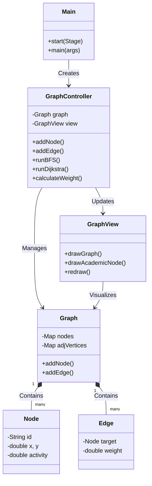
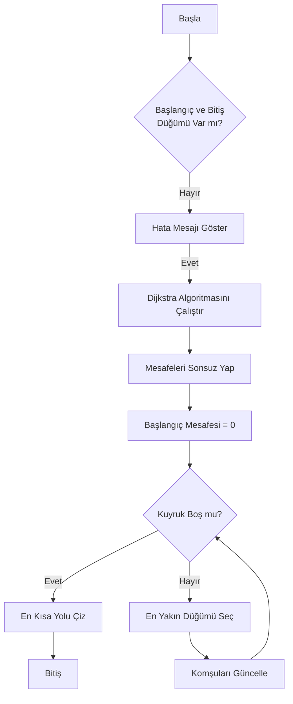
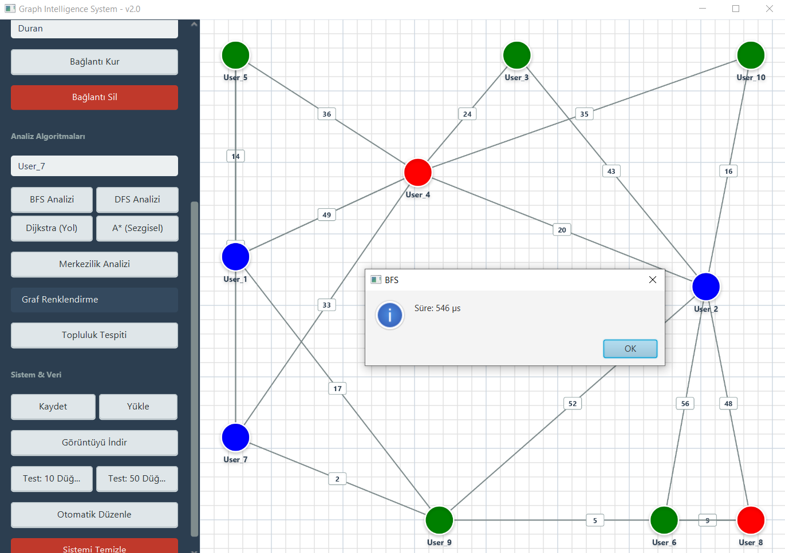
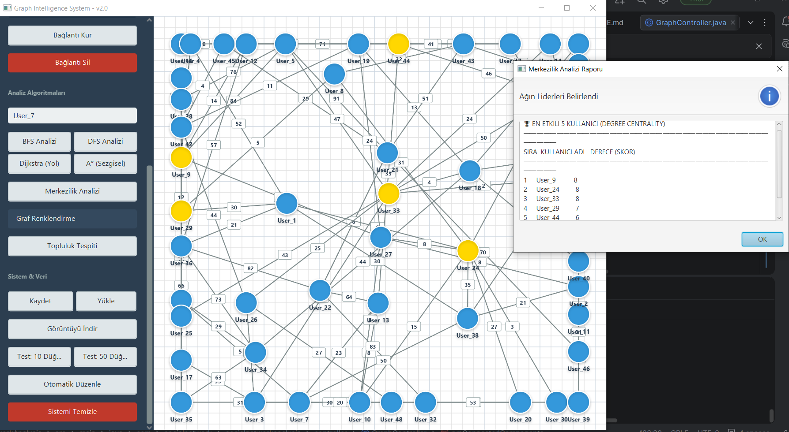

# 🕸️ Sosyal Ağ Analizi (SNA) Projesi

**Ders:** Yazılım Laboratuvarı I
**Dönem:** 2025-2026 Güz
**Grup Üyeleri:**
* Duran Can Demirezen - 211307037
* Yaman Ceylan - 181307031

## 📋 Proje Tanımı
Bu proje, kullanıcılar ve aralarındaki etkileşimleri modelleyen, çeşitli graf teorisi algoritmaları (BFS, DFS, Dijkstra, A*) ile analiz yapan ve sonuçları görselleştiren bir Java masaüstü uygulamasıdır.

## 🚀 Özellikler
* **Dinamik Ağırlık Hesabı:** Düğümlerin aktiflik ve etkileşim puanlarına göre kenar ağırlıkları otomatik hesaplanır.
* **Görselleştirme:** Düğümler ve bağlantılar JavaFX Canvas üzerinde interaktif olarak çizilir.
* **Veri Saklama:** Graf yapısı CSV formatında kaydedilip tekrar yüklenebilir.
* **Algoritmalar:** En kısa yol, merkezilik analizi ve topluluk tespiti yapılabilir.

## 🛠️ Kurulum ve Çalıştırma
1. Projeyi klonlayın.
2. Maven bağımlılıklarını yükleyin.
3. `Main.java` dosyasını çalıştırın.

## 📊 Sistem Mimarisi (Class Diagram)

Aşağıdaki diyagram projenin temel sınıf yapısını göstermektedir:



```markdown
## 🧪 Test Sonuçları

### Senaryo 1: 10 Düğüm BFS Testi


### Senaryo 2: 50 Düğüm Merkezilik Analizi

```