# 🕸️ Sosyal Ağ Analizi (SNA) Projesi

**Ders:** Yazılım Laboratuvarı I
**Dönem:** 2025-2026 Güz
**Grup Üyeleri:**
* Duran Can Demirezen - 211307037
* Yaman Ceylan - 181307031

## 📋 Proje Tanımı
Bu proje, kullanıcılar ve aralarındaki etkileşimleri modelleyen, çeşitli graf teorisi algoritmaları (BFS, DFS, Dijkstra, A*) ile analiz yapan ve sonuçları görselleştiren bir Java masaüstü uygulamasıdır.

## 🚀 Özellikler
* **Dinamik Ağırlık Hesabı:** Düğümlerin aktiflik ve etkileşim puanlarına göre kenar ağırlıkları otomatik hesaplanır.
* **Görselleştirme:** Düğümler ve bağlantılar JavaFX Canvas üzerinde interaktif olarak çizilir.
* **Veri Saklama:** Graf yapısı CSV formatında kaydedilip tekrar yüklenebilir.
* **Algoritmalar:** En kısa yol, merkezilik analizi ve topluluk tespiti yapılabilir.

## 🛠️ Kurulum ve Çalıştırma
1. Projeyi klonlayın.
2. Maven bağımlılıklarını yükleyin.
3. `Main.java` dosyasını çalıştırın.

## 📊 Sistem Mimarisi (Class Diagram)

Aşağıdaki diyagram projenin temel sınıf yapısını göstermektedir:

## 🔄 Algoritma Akışı (Dijkstra)

```mermaid
flowchart TD
    A[Başla] --> B{Başlangıç ve Bitiş\nDüğümü Var mı?}
    B -- Hayır --> C[Hata Mesajı Göster]
    C -- Evet --> D[Dijkstra Algoritmasını Çalıştır]
    D --> E[Mesafeleri Sonsuz Yap]
    E --> F[Başlangıç Mesafesi = 0]
    F --> G{Kuyruk Boş mu?}
    G -- Evet --> H[En Kısa Yolu Çiz]
    G -- Hayır --> I[En Yakın Düğümü Seç]
    I --> J[Komşuları Güncelle]
    J --> G
    H --> K[Bitiş]
```

## 🧪 Test Sonuçları

### Senaryo 1: 10 Düğüm BFS Testi

### Senaryo 2: 50 Düğüm Merkezilik Analizi

## 🧪 Test ve Performans Sonuçları

Orta ölçekli (50 Düğüm) graf üzerinde yapılan testlerde, başlangıç düğümü **User_7** olarak seçilmiş ve algoritmaların çalışma süreleri mikrosaniye (µs) cinsinden ölçülmüştür.

### 📊 Performans Tablosu

| Algoritma             | Çalışma Süresi (µs) | Karmaşıklık Analizi |
|-----------------------|---------------------|---------------------|
| **DFS**               | 423 µs              | O(V + E) - En Hızlı |
| **BFS**               | 684 µs              | O(V + E)            |
| **Dijkstra**          | 2314 µs             | O(E + V log V)      |
| **A*** **(Sezgisel)** | 264 µs              | O(E) (Sezgisel)     |

> **Analiz:** DFS, derinlemesine arama yaptığı ve tüm ağacı taramak zorunda kalmadan hedefe (veya sonuna) hızlıca ulaştığı için bu senaryoda en hızlı sonucu vermiştir. Dijkstra, en kısa yolu garanti etmek için tüm ağırlıkları hesapladığından daha uzun sürmüştür.

### 📸 Test Ekran Görüntüleri

**1. BFS Algoritması Sonucu:**

**2. DFS Algoritması Sonucu:**

**3. Dijkstra Algoritması Sonucu:**

**4. A*** **(Sezgisel) Algoritması Sonucu:**
